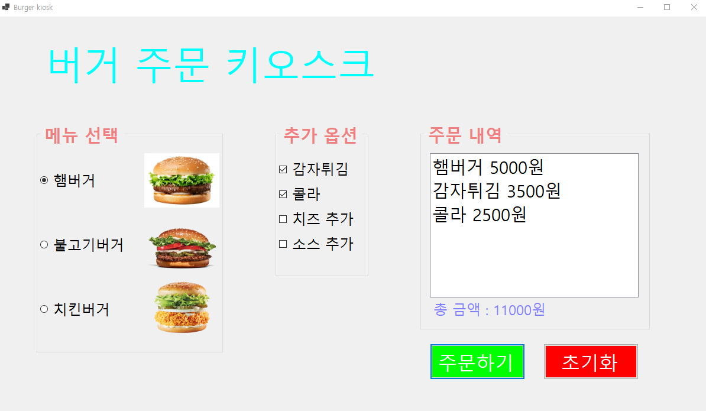
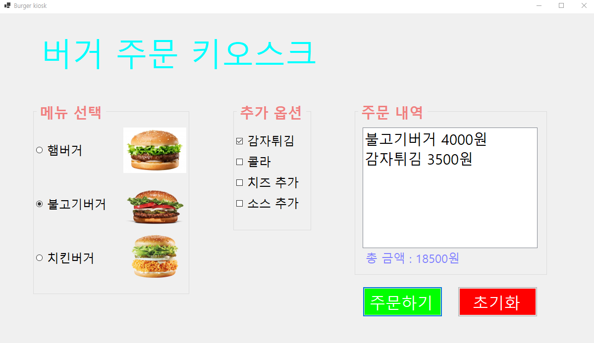
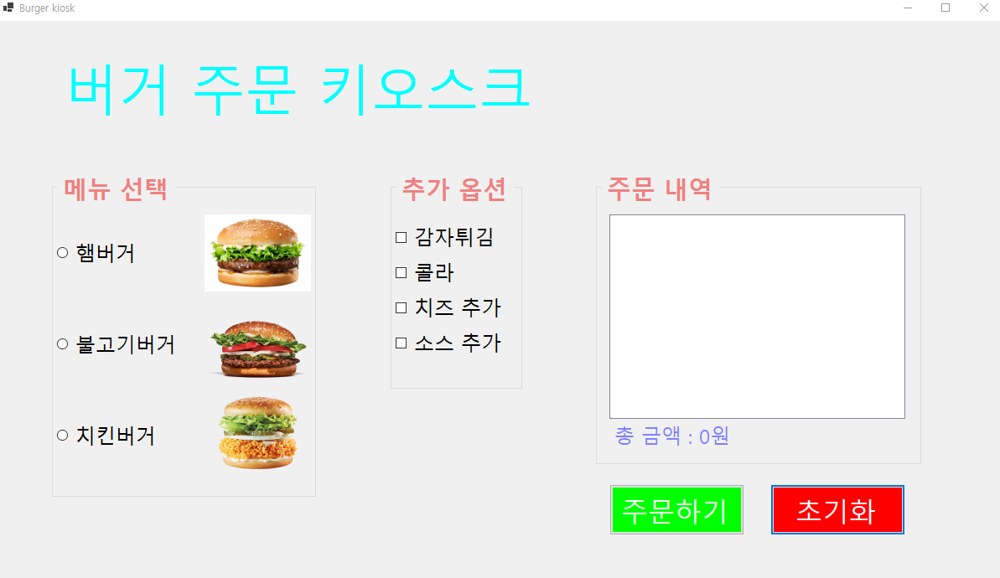
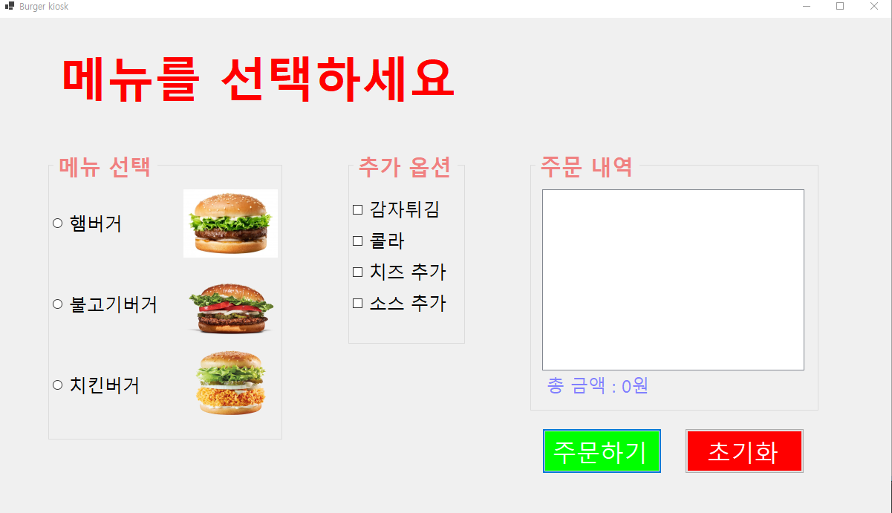

# (C# 코딩) 버거 주문 키오스크

## 개요

   - **C# 프로그래밍 학습**
   - **1줄 소개**:
     사용자가 버거 메뉴와 추가 옵션을 선택하면 주문 내역을 확인하고 총 금액을 계산해 주는 무인 주문 시스템 프로그램입니다.
   - **사용한 플랫폼**:
     C#, .NET Windows Forms, Visual Studio, GitHub.
   - **사용한 컨트롤**:
     `GroupBox`, `RadioButton`, `CheckBox`, `ListBox`, `Label`, `Button`.
   - **사용한 기술과 구현한 기능**:
     - 단일 선택 및 다중 선택: `RadioButton`을 이용해 메뉴 중 하나만 선택하게 하고, `CheckBox`로 여러 사이드 메뉴를 동시에 선택할 수 있도록 구현했습니다.
     - 가격 계산 로직: `totalCost` 변수를 사용하여 선택된 항목들의 가격을 누적 합산하는 로직을 구현했습니다.
     - UI 업데이트: 주문 버튼 클릭 시 `ListBox`에 항목별 가격을 출력하고, `Label`에 최종 합산 금액을 표시합니다.
     - 예외 처리 및 초기화: 메뉴를 선택하지 않았을 때의 에러 처리와 모든 선택을 처음으로 돌리는 초기화 기능을 포함합니다.
## 실행 화면 (과제 1)
-과제1 코드의 실행 스크린샷

- **구현한 내용과 기능 설명**:
    - **UI 구성**: '메뉴 선택', '추가 옵션', '주문 내역' 영역을 `GroupBox`로 구분하여 시각적으로 그룹화했습니다.
    - **메뉴 선택**: 햄버거(5,000원), 불고기버거(4,000원), 치킨버거(3,000원) 중 하나를 선택할 수 있는 `RadioButton` 배치를 완료했습니다.
    - **옵션 선택**: 감자튀김, 콜라 등 4가지 옵션을 자유롭게 선택할 수 있는 `CheckBox`를 구현했습니다.
    - **동작 버튼**: '주문하기' 버튼으로 리스트박스에 내역을 추가하고 총액을 갱신하며, '초기화' 버튼으로 모든 선택을 해제합니다.

## 배운 내용
- `RadioButton`은 그룹 내에서 하나만 선택되므로 대표 메뉴 설정에 적합하고, `CheckBox`는 독립적으로 작동하여 옵션 추가에 적합하다는 차이점을 학습했습니다.

