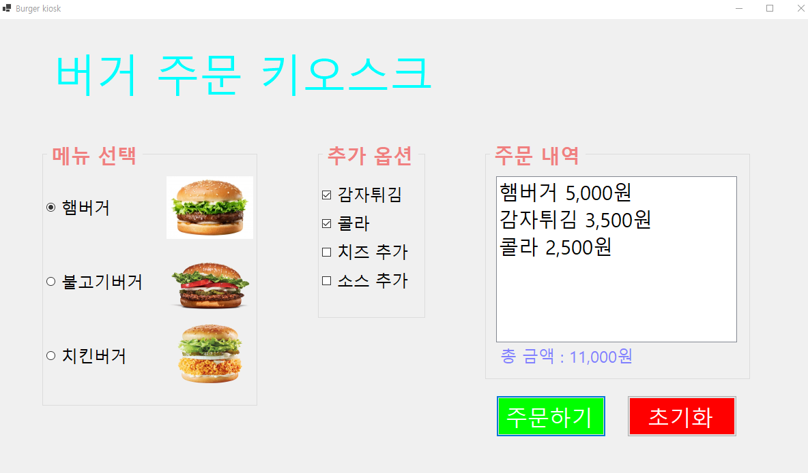
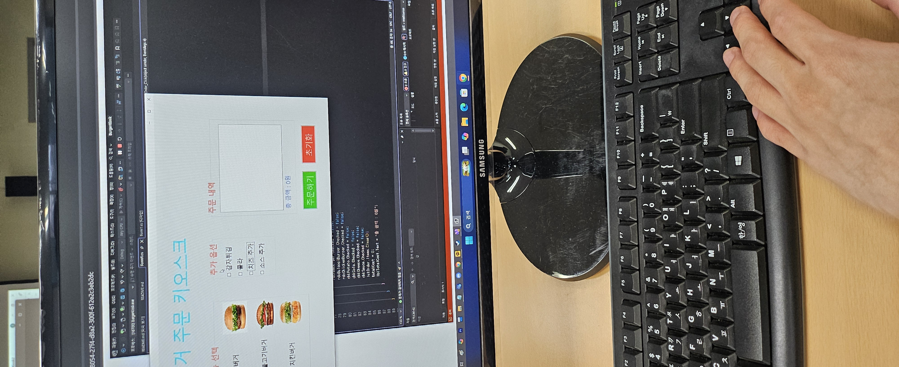
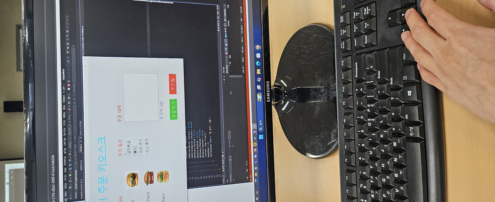
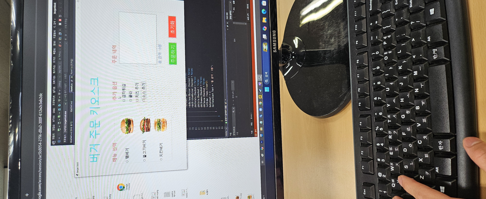
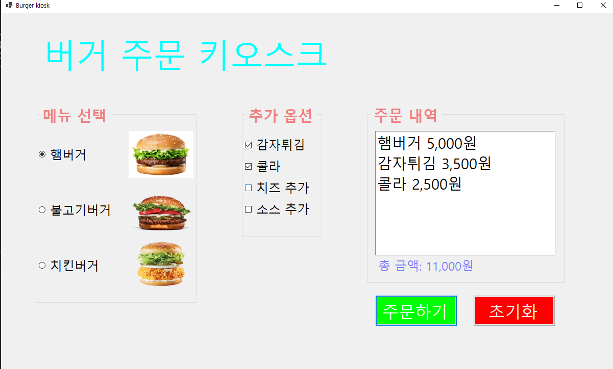
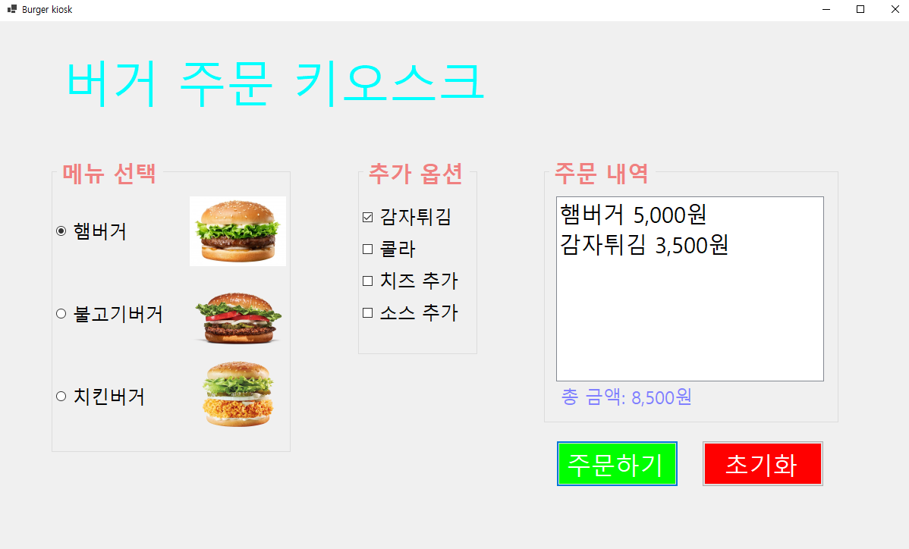

# (C# 코딩) 버거 주문 키오스크

## 개요

   - **C# 프로그래밍 학습**
   - **1줄 소개**:
     사용자가 버거 메뉴와 추가 옵션을 선택하면 주문 내역을 확인하고 총 금액을 계산해 주는 무인 주문 시스템 프로그램입니다.
   - **사용한 플랫폼**:
     C#, .NET Windows Forms, Visual Studio, GitHub.
   - **사용한 컨트롤**:
     `GroupBox`, `RadioButton`, `CheckBox`, `ListBox`, `Label`, `Button`.
   - **사용한 기술과 구현한 기능**:
     - 단일 선택 및 다중 선택: `RadioButton`을 이용해 메뉴 중 하나만 선택하게 하고, `CheckBox`로 여러 사이드 메뉴를 동시에 선택할 수 있도록 구현했습니다.
     - 가격 계산 로직: `totalCost` 변수를 사용하여 선택된 항목들의 가격을 누적 합산하는 로직을 구현했습니다.
     - UI 업데이트: 주문 버튼 클릭 시 `ListBox`에 항목별 가격을 출력하고, `Label`에 최종 합산 금액을 표시합니다.
     - 예외 처리 및 초기화: 메뉴를 선택하지 않았을 때의 에러 처리와 모든 선택을 처음으로 돌리는 초기화 기능을 포함합니다.
     
## 실행 화면 (과제 1)
-과제1 코드의 실행 스크린샷

- **과제 내용**:

    - RadioButton과 CheckBox 등을 활용하여 버거 메뉴와 추가 옵션을 선택할 수 있는 화면을 디자인하고, GroupBox를 사용하여 각 영역을 시각적으로 그룹화합니다.
    - '주문하기' 버튼을 클릭하면 선택된 항목의 상세 내역과 합산된 총 금액을 출력하고, '초기화' 버튼으로 모든 선택 상태를 처음으로 되돌리는 기본 로직을 구현합니다

- **구현 내용과 기능 설명**:
    - **UI 구성**: '메뉴 선택', '추가 옵션', '주문 내역' 영역을 `GroupBox`로 구분하여 시각적으로 그룹화했습니다.
    - **메뉴 선택**: 햄버거(5,000원), 불고기버거(4,000원), 치킨버거(3,000원) 중 하나를 선택할 수 있는 `RadioButton` 배치를 완료했습니다.
    - **옵션 선택**: 감자튀김, 콜라 등 4가지 옵션을 자유롭게 선택할 수 있는 `CheckBox`를 구현했습니다.
    - **동작 버튼**: '주문하기' 버튼으로 리스트박스에 내역을 추가하고 총액을 갱신하며, '초기화' 버튼으로 모든 선택을 해제합니다.

## 실행 화면 (과제 2)

-과제2 코드의 실행 스크린샷

- **과제 내용**:

    - 사용자가 버거 메뉴를 하나도 선택하지 않은 상태에서 '주문하기' 버튼을 누를 경우, 이를 인지할 수 있도록 에러 메시지를 제공합니다

    - 사용자 경험(UX)을 고려하여 팝업 형태의 MessageBox 대신 화면상의 Label 컨트롤을 활용하여 경고 문구를 표시하도록 구현합니다.

- **구현 내용과 기능 설명**:

    - **메뉴 선택 여부 검증**: btnOrder_Click 메서드 내에서 if-else 조건문을 사용하여 라디오버튼들(rdoHamBurger, rdoBulgogiBurger, rdoChickenBurger) 중 어느 하나라도 Checked가 true인지 검사합니다.
    - **비침습적 에러 표시**: 필수 항목이 누락된 경우, 미리 배치해 둔 lblError 레이블의 Visible 속성을 true로 변경하여 "메뉴를 선택하세요"라는 안내 메시지를 노출합니다.
    - **동적 UI 피드백**: 정상적으로 메뉴가 선택되어 주문이 진행되면 에러 레이블을 다시 숨겨(Visible = false), 사용자가 현재 상태를 직관적으로 이해할 수 있도록 설계했습니다.
    - **예외 상황 대응**: 메뉴 미선택 시 return 문을 사용하여 하단의 가격 계산 및 리스트 박스 추가 로직이 실행되지 않도록 차단함으로써 데이터의 무결성을 유지했습니다.

## 실행 화면 (과제 3)

-과제3 코드의 실행 스크린샷 

- **과제 내용**

    - 마우스 사용이 어려운 환경이나 빠른 입력을 선호하는 사용자를 위해 **마우스 없이 키보드 입력만으로 주문이 가능**하게 만듭니다.
    - 입력 컨트롤 간의 **포커스 흐름을 정리**하여 사용자가 혼란 없이 주문 단계를 진행할 수 있도록 UX를 개선합니다.

- **구현 내용과 기능 설명**

    - 그룹 간 이동 (Tab)** : 사용자가 `Tab` 키를 누를 때 '메뉴 선택' → '추가 옵션' → '주문하기' 버튼 순으로 **GroupBox 및 주요 버튼 사이를 논리적으로 이동**할 수 있도록 탭 순서를 변경했습니다.
    - 항목 간 이동 (방향키)** : 라디오버튼이나 체크박스 그룹 내에서 **방향키를 이용해 아이템 사이를 자유롭게 이동**하며 선택 대상을 바꿀 수 있습니다.
    - 아이템 선택 (Space)** : 원하는 메뉴나 옵션에 포커스가 위치했을 때 **`Space` 키를 눌러 즉시 선택(Check)** 상태를 변경할 수 있습니다.
    - 버튼 실행 (Enter)** : '주문하기'나 '초기화' 버튼에 포커스가 있을 때 **`Enter` 키를 눌러 해당 기능을 실행**할 수 있도록 설정했습니다.
    - 포커스 최적화 (TabStop)** : 단순히 정보만 전달하는 레이블(Label)이나 배경 요소들의 **`TabStop` 옵션을 `false`로 변경**하여, 불필요한 탭 이동을 방지하고 핵심 컨트롤에만 포커스가 가도록 정밀하게 제어했습니다.

## 실행 화면 (과제 4)

-과제4 코드의 실행 스크린샷 

- 과제 내용

  - 사용자가 메뉴(RadioButton) 또는 옵션(CheckBox)을 선택/해제할 때마다 주문 내역과 총 금액을 즉시 갱신하도록 구현합니다.
  
  - 별도의 '주문하기' 버튼 클릭 없이도 현재 주문 상태가 항상 최신으로 표시되어야 하며, 기존 과제들(메뉴 선택 검증, 키보드 접근성 등)의 동작을 유지합니다.

- 구현 내용과 기능 설명

  - CheckedChanged 이벤트 연결:
     - 모든 RadioButton과 CheckBox의 CheckedChanged 이벤트를 Item_CheckedChanged 공통 핸들러에 연결하여 상태 변경 시 UpdateOrder()를 호출합니다.
    
  - UpdateOrder 분리:
     - UpdateOrder() 메서드에서 선택된 항목을 검사해 ListBox에 주문 내역을 채우고 현재 상태의 총 금액을 계산해 Label에 출력하도록 책임을 분리했습니다.
     - 해당 과정에서 viewTotalCost() 메서드를 호출하여 총 금액 계산 로직을 별도로 관리합니다.
    
  - 에러 처리:
     - 메인 메뉴가 하나도 선택되어 있지 않으면 주문 버튼 클릭 시 lblError를 표시하고 주문을 중단합니다. UpdateOrder에서는 메뉴 선택 시 lblError를 자동으로 숨깁니다.
    
  - 키보드/UX 유지:
     - AcceptButton으로 btnOrder를 설정해 Enter로 주문 가능하도록 유지하고, TabIndex 및 ActiveControl 설정으로 탭 흐름과 기본 포커스를 제어합니다.
    
  - 초기화:
     - 초기화 버튼(btnClear) 클릭 시 모든 라디오/체크박스의 Checked를 false로 설정하고 lblError를 숨기며 포커스를 총액 라벨로 이동합니다.

